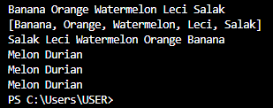
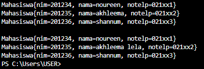

# LAPORAN JOBSHEET 15 PRAKTIKUM ALGORITMA DAN STRUKTUR DATA

Dibuat oleh : 

Yasmine Navisha Andhani 

1F D4 Teknik Informatika 

2141720047 

## 16.2 Kegiatan Praktikum 1
### 16.2.1 Percobaan 1
1. Buatlah sebuah class ContohList yang main methode berisi kode program seperti di bawah ini 

2. Tambahkan kode program untuk menggunakan collection dengan aturan penulisan kode program seperti berikut 

### 16.2.2 Verifikasi Hasil Percobaan

### 16.2.3 Pertanyaan Percobaan
1. Perhatikan baris kode 25-36, mengapa semua jenis data bisa ditampung ke dalam sebuah Arraylist?
> : Karena ArrayList bersifat ArrayList dinamis yang mana dapat berubah ukurannya dan dapat menampung semua jenis data serta pada ArrayList tidak diberikan syarat (<>) sehingga ArrayList dapat menampung semua jenis data
2. Modifikasi baris kode 25-36 seingga data yang ditampung hanya satu jenis atau spesifik tipe tertentu!
> : 
3. Ubah kode pada baris kode 38 menjadi seperti ini 

 
> : 
4. Tambahkan juga baris berikut ini, untuk memberikan perbedaan dari tampilan yang sebelumnya 

> : 
5. Dari penambahan kode tersebut, silakan dijalankan dan apakah yang dapat Anda jelaskan! 
> :  

Karena ArrayList mempunyai method add() dan get() sehingga 2 kode tersebut tidak bekerja dalam arrayList

## 16.3 Kegiatan Praktikum 2
### 16.3.1 Tahapan Percobaan
1. Buatlah class dengan nama LoopCollection serta tambahkan method main yang isinya adalah sebagai berikut. 

2. Tambahkan potongan kode berikut ini dari yang sebelumnya agar proses menampilkan elemen pada sebuah stack bervariasi.

### 16.3.2 Verifikasi Hasil Percobaan

### 16.3.3 Pertanyaan Percobaan
1. Apakah perbedaan fungsi push() dan add() pada objek fruits?
> : - push() : dari Stack 

- add() : dari iterator (Queue)
2. Silakan hilangkan baris 43 dan 44, apakah yang akan terjadi? Mengapa bisa demikian?
> : Data Melon dan Durian tidak ada (tidak muncul) karena data tidak dimasukkan
3. Jelaskan fungsi dari baris 46-49?
> : hasNext() digunakkan untuk mengecek data selanjutnya ada atau tidak.
4. Silakan ganti baris kode 25, Stack<String> menjadi List<String> dan apakah yang terjadi? Mengapa bisa demikian?
> : Program akan error karena belum melakukan import List
5. Ganti elemen terakhir dari dari objek fruits menjadi “Strawberry”!
> : 
6. Tambahkan 3 buah seperti “Mango”,”guava”, dan “avocado” kemudian dilakukan sorting!
> :  

 

## 16.4 Kegiatan Praktikum 3
### 16.4.1 Tahapan Percobaan
1. Buatlah sebuah class Mahasiswa dengan attribute, kontruktor, dan fungsi sebagai berikut. 

2. Selanjutnya, buatlah sebuah class ListMahasiswa yang memiliki attribute seperti di bawah ini 

3. Method tambah(), hapus(), update(), dan tampil() secara berurut dibuat agar bisa melakukan operasi-operasi seperti yang telah disebutkan. 

4. Untuk proses hapus, update membutuhkan fungsi pencarian terlebih dahulu yang potongan kode programnya adalah sebagai berikut 

5. Pada class yang sama, tambahkan main method seperti potongan program berikut dan amati hasilnya! 

### 16.4.2 Verifikasi Hasil Percobaan

### 16.4.3 Pertanyaan Percobaan
1. Pada fungsi tambah() yang menggunakan unlimited argument itu menggunakan konsep apa? Dan kelebihannya apa?
> : Menggunakan konsep Array.aslist yang memiliki kelebihan dapat diakses sebagai array dalam metode
2. Pada fungsi linearSearch() di atas, silakan diganti dengan fungsi binarySearch() dari collection!
> :  

 

 

3. Tambahkan fungsi sorting baik secara ascending ataupun descending pada class tersebut!
> :  

 

## 16.5 Tugas Praktikum
1. Implementasikan stack menggunakan collection dengan contoh kasus tumpukan daftar film sesuai dengan fitur-fitur yang ditunjukkan pada gambar di bawah ini! 

 

 

 

 

 

 

 

 

 

 

 

2. Buatlah implementasi program daftar nilai mahasiswa semester, minimal memiliki 3 class yaitu Mahasiswa, Nilai, dan Mata Kuliah. Khusus untuk data Mahasiswa dan Mata Kuliah harus sudah diinisialisasi, sehingga ketika memasukkan data nilai data mahasiswa dan mata kuliah cukup menginputkan nim ataupun kode mata kuliah. Yang paling penting adalah antara objek 
mahasiswa, matakuliah, dan nilai harus saling terhubung. 

 

 

 

 

 

 

 

 

 

 

 

 

 

 
